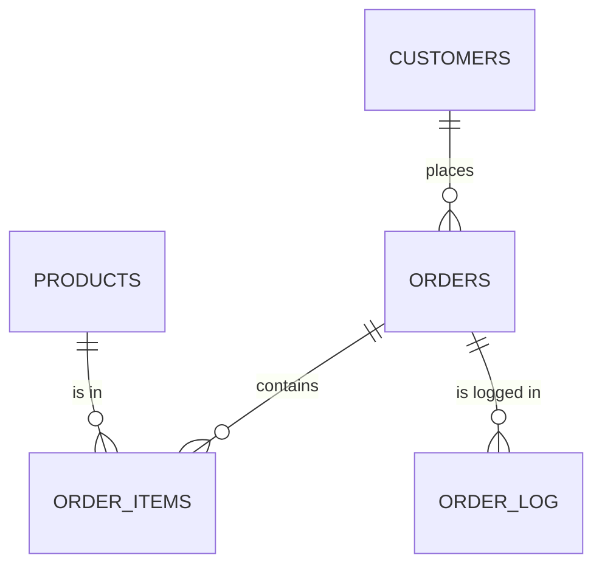

# Online Store Database

A small PostgreSQL database for an online store. The main idea of the project is to keep the order logic **inside the database**: functions, procedures and triggers calculate totals, control stock and write an audit log automatically.

**Tech:** PostgreSQL, SQL, PL/pgSQL

## What it does

- Creates orders for customers
- Adds products to an order with the **current price** of the product
- Checks that there is enough stock and decreases it
- Recalculates the order total automatically
- Logs every created order

## Tables

| Table | Description |
|---|---|
| `customers` | name, email, balance |
| `products` | name, price, stock quantity |
| `orders` | customer, date, total amount |
| `order_items` | products inside an order (quantity and price at the time of purchase) |
| `order_log` | audit log of created orders |



`order_log` stores `order_id` without a foreign key on purpose: log records should stay even if an order is deleted later.

## Database logic

| Object | Type | What it does |
|---|---|---|
| `calculate_order_total(order_id)` | function | returns the sum of `quantity * price` for an order |
| `create_order(customer_id)` | procedure | creates an empty order, fails if the customer does not exist |
| `add_product_to_order(order_id, product_id, quantity)` | procedure | checks quantity and stock, adds the item with the current price, decreases stock |
| `trg_recalculate_total_amount` | trigger on `order_items` | updates `orders.total_amount` after insert, update or delete |
| `trg_order_audit_log` | trigger on `orders` | writes a `created` row to `order_log` |

### Example

```sql
call create_order(1);
call add_product_to_order(1, 1, 4);   -- order 1, product 1, quantity 4

select total_amount from orders where order_id = 1;
select * from order_log;
```

If something is wrong, the procedures stop with a clear error:

```
ERROR:  Not enough stock: available 7, requested 100
```

## Design decisions

- **Price is copied into `order_items`.** If the product price changes later, old orders keep the price the customer actually paid.
- **Errors instead of silent `return`.**. It raises an exception, so the caller knows the product was not added.
- **`FOR UPDATE` on the product row.** It prevents two orders from taking the last items at the same time.
- **`CHECK` constraints.** Price, stock and quantity cannot be negative, even if someone inserts data manually.
- **`coalesce(new.order_id, old.order_id)` in the trigger.** On insert only `NEW` exists, on delete only `OLD`, so one function handles all cases.

## Testing

All checks are in manual_tests.sql with the expected result in comments: customer and product creation, order creation, logging, adding items, automatic totals, stock decrease, error cases and delete.

## Query analysis

```sql
explain analyze
select oi.order_id, p.product_name, oi.quantity, oi.price,
       oi.quantity * oi.price as item_total
from order_items oi
join products p on oi.product_id = p.product_id
where oi.order_id = 1;
```

Execution plan:

```
Hash Join  (cost=27.09..41.32 rows=7 width=274) (actual time=0.056..0.058 rows=1.00 loops=1)
  Hash Cond: (p.product_id = oi.product_id)
  Buffers: shared hit=2
  ->  Seq Scan on products p  (cost=0.00..13.00 rows=300 width=222) (actual time=0.022..0.022 rows=2.00 loops=1)
        Buffers: shared hit=1
  ->  Hash  (cost=27.00..27.00 rows=7 width=28) (actual time=0.020..0.021 rows=1.00 loops=1)
        Buckets: 1024  Batches: 1  Memory Usage: 9kB
        Buffers: shared hit=1
        ->  Seq Scan on order_items oi  (cost=0.00..27.00 rows=7 width=28) (actual time=0.017..0.017 rows=1.00 loops=1)
              Filter: (order_id = 1)
              Buffers: shared hit=1
Planning Time: 0.268 ms
Execution Time: 0.087 ms
```

PostgreSQL used a **Hash Join**: it reads `order_items` (filtered by `order_id = 1`), builds a hash table from it and then looks up matching rows from `products`. Both tables are read with a **Seq Scan**, and the query took **0.087 ms**. All data came from memory (`shared hit`), nothing was read from disk.

With only a few rows a sequential scan is the cheapest option, so no index is needed here. If `order_items` grew to hundreds of thousands of rows, an index on `order_items(order_id)` would make sense.

## Limitations

- Deleting an order item does not return the product to stock.
- Customer `balance` is stored but not used yet (payments are not implemented).
- No order status (new, paid, cancelled).

## Skills Practiced

- SQL functions
- SQL procedures
- triggers
- audit logging
- testing database logic
- basic Git workflow
- basic query analysis with EXPLAIN ANALYZE

## Possible next steps

- Return stock when an item is deleted
- Check and deduct customer balance when an order is paid
- Add order statuses
- Add an index on `order_items(order_id)` and test it on a larger dataset